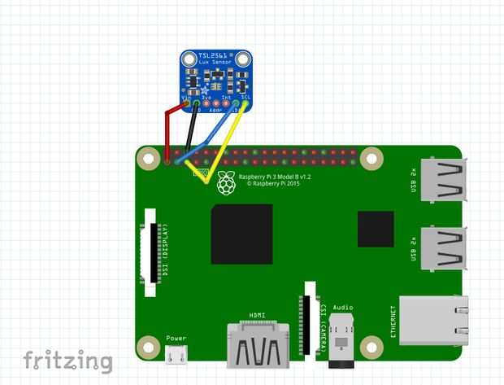

# PI Light Sensor

This goal of this project is to have a Raspberry PI monitor the
state of a LED. When the light is lit the Raspberry should make
a request to a HTTP Server to notify that the state has changed.

## Hardware

* Raspberry PI 3 model B
* [Adafruit TSL2561 Luminosity sensor](https://www.adafruit.com/product/439)

The image above is copied from [Instructables.com](http://www.instructables.com/id/Lux-Sensor-TSL2561-Raspberry-Pi/)

## OS

The project uses Raspbian, which had i2c enabled as default setup. 

## Dependencies

The project uses i2c from [Golang experimental packages](https://github.com/golang/exp/tree/master/io/i2c)

## Inspiration

The Python project http://www.raspberryconnect.com/hardware-add-ons/item/324-tsl2561-luminosity-sensor-ir-and-visible-light

## Installation

1. Build the application using `./build.sh`
2. Copy it to /home/pi/pi-light-sensor
3. Copy the file `init.d/pi-light-sensor` to /etc/init.d
4. Edit /etc/init.d/pi-light-sensor and change the notify URL:s to what you need
5. Execute `sudo update-rc.d pi-light-sensor defaults 2345`